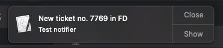
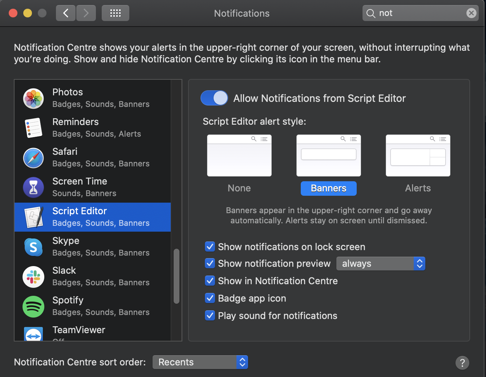
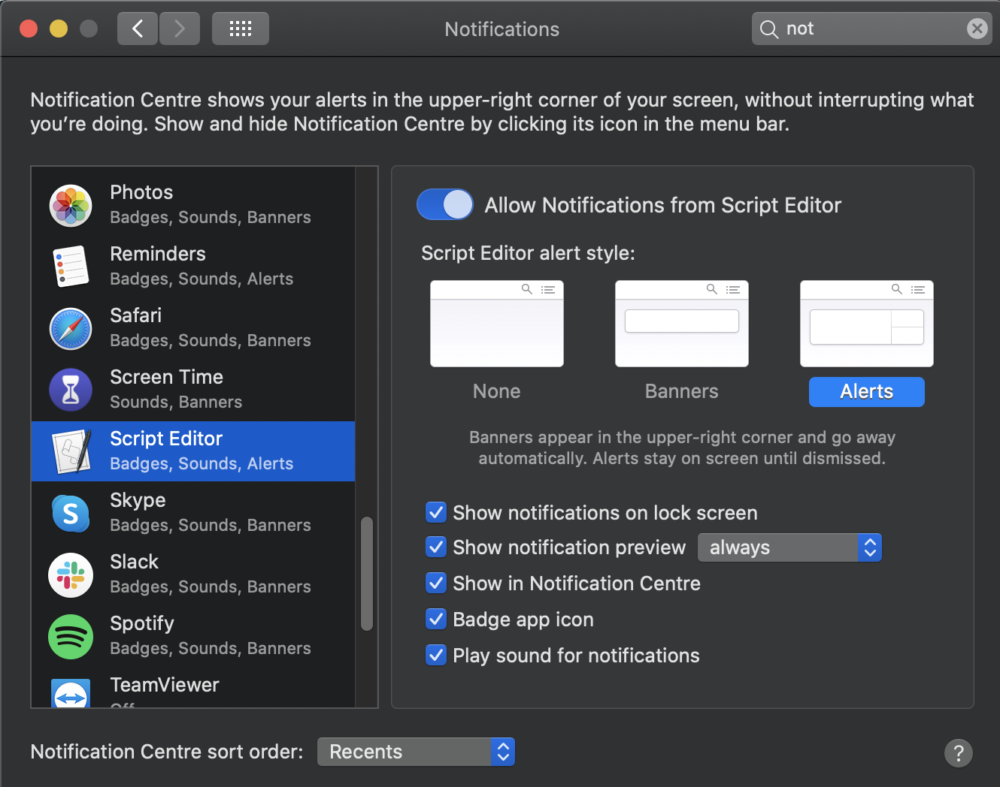

<h1>TicketNotifier</h1>
Simple MacOS Notifier made by python

<h3>Requirements</h3>
Python3

<h3>How to install</h3>
Update: api_key, domain, password in the FDcredentianls.py file
 
 
 Change notification style for "Script Editor"
 
 From this
To this

 
 open crontab:
 crontab -e
 <code>*/10 * * * * python3 /{path_to_script}/TicketNotifier.py > /tmp/stdout.log 2>/tmp/stderr.log</code>
